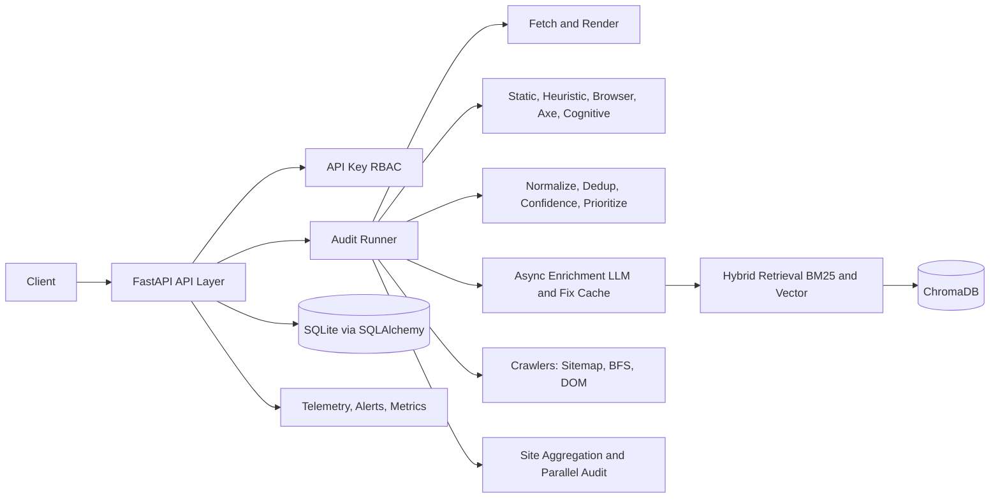



# BEACON Accessibility Intelligence Engine

BEACON is a FastAPI-based accessibility auditing platform with multi-engine scanning, crawler-assisted discovery, RAG-backed remediation, observability, and API-key RBAC.

## Latest Updates (April 14, 2026)

- Standardized production scan profiles for site scans (fast/deep/max) with centralized limits in `app/config.py`.
- Added hard safety caps for predictable runtime behavior:
  - `MAX_SCAN_GLOBAL_CAP=80`
  - `MAX_CONCURRENT_SITE_AUDITS=3`
- Dashboard deep/max scan budgets now use centralized caps:
  - deep: 12 pages
  - max: 25 pages
- Dashboard deep/max requests run through the multi-page site orchestrator, with stable normalized metrics:
  - `issue_types_count`
  - `failing_elements_count`
  - `pages_scanned`
  - `pages_discovered`

## Latest Updates (April 2026)

- Restored and hardened multi-mode audit flow: minimal, fast, deep, and max.
- Added crawler stack modules for sitemap, BFS, and DOM discovery under app/crawlers.
- Added multi-state audit orchestration and site-level aggregation under app/audit.
- Added API-key middleware and URL SSRF protections under app/security.
- Added telemetry, alerting, and Prometheus metrics plumbing under app/observability.
- Added reliability hardening for zero-score empty-output failures:
  - output invariants on final payloads
  - stale cache poisoning rejection and recompute
  - non-empty site score safeguards
- Added targeted regression tests for critical bug prevention.

## Latest Updates (April 12, 2026)

- Hardened detector behavior for modern app shells and dynamic sites.
- Added shell-aware landmark suppression to avoid pre-hydration false positives on React and Next.js pages.
- Expanded ARIA role validation to catch mixed valid/invalid role token lists and duplicate role tokens.
- Normalized blocked or partial fetch outcomes into explicit availability findings (access-limited classification).
- Added deterministic site-archetype validation script and baseline output:
  - `evaluation/validate_site_archetypes.py`
  - `evaluation/site_archetype_validation_results.json` (10/10 passing)
- Revalidated ACT regression benchmark with perfect detector metrics:
  - 23 cases evaluated, TP=38, FP=0, FN=0
  - Micro and adjudicated precision/recall/F1 = 1.00
- Re-ran real-world 10-site production benchmark (fast + deep):
  - Runtime success: 20/20 audits
  - Suppression warnings: 0
  - Fast P95: 2.56s (gate <= 3.5s)
  - Deep P95: 27.86s (gate < 60s)
  - Expectation alignment remains advisory on applicable audits; access-limited pages are excluded from strict alignment scoring.

## Architecture



## Scan Modes

| Mode    | Purpose                         | Typical Engines                                  |
| :------ | :------------------------------ | :----------------------------------------------- |
| minimal | quickest deterministic baseline | static + heuristic only                          |
| fast    | rapid production checks         | static + heuristic                               |
| deep    | comprehensive page analysis     | static + heuristic + browser + axe (+ cognitive on single-page `/audit`) |
| max     | deepest interactive exploration | deep + interaction/scroll + cognitive layers     |

## Production Scan Profiles (Site Scan Path)

These limits are centralized in `app/config.py` and enforced by the scan-mode runner.

| Mode | max_pages | crawl_cap | bfs_depth | bfs_pages | dom_pages | stage1_timeout_s | stage2_timeout_s | global_sla_s | concurrency |
| :--- | ---: | ---: | ---: | ---: | ---: | ---: | ---: | ---: | ---: |
| fast | 1 | 10 | 1 | 10 | 0 | 12 | 4 | 35 | 5 |
| deep | 12 | 30 | 3 | 30 | 0 | 25 | 12 | 120 | 3 |
| max  | 25 | 70 | 4 | 60 | 15 | 40 | 18 | 240 | 2 |

Global caps:

- `MAX_SCAN_GLOBAL_CAP=80`
- `MAX_CONCURRENT_SITE_AUDITS=3`

Dashboard caps:

- `DASHBOARD_DEEP_SCAN_MAX_PAGES=12`
- `DASHBOARD_MAX_SCAN_MAX_PAGES=25`

In max mode, quality gate metadata includes execution proof fields such as:

- playwright_invoked
- interaction_phase_ran
- scroll_phase_ran
- exploration_layer_ran

## Reliability and Safety Guarantees

Recent hardening prevents the zero-score and empty-output failure class:

- base audit result is protected from enrichment failure side effects
- pages audited cannot return non-positive score without safe repair
- issues payload is always list-normalized
- stale cached payloads with invalid invariants are discarded and recomputed
- site aggregator enforces non-empty page score guardrails

## Repository Layout

- app/
  - app/services: core engines, scoring, enrichment, caching
  - app/audit: page auditor, parallel runner, site aggregation, scan-mode runner
  - app/crawlers: sitemap, BFS, DOM crawlers and orchestrator
  - app/security: API-key RBAC and URL validation
  - app/observability: telemetry, alerts, logging, metrics
  - app/db: SQLAlchemy models and repository
- corpus/: source corpus used for ingestion and RAG
- resources/: architecture and planning documents
- tests/: unit and benchmark-related test assets
- .env.example: environment variable template

## Setup

### 1. Prerequisites

- Python 3.10+
- pip
- Optional for deep and max browser scans: Playwright Chromium

### 2. Configure Environment

Create local environment file:

```bash
cp .env.example .env
```

On PowerShell:

```powershell
Copy-Item .env.example .env
```

Set at minimum:

- FEATHERLESS_API_KEY
- BOOTSTRAP_VIEWER_API_KEY
- BOOTSTRAP_AUDITOR_API_KEY
- BOOTSTRAP_ADMIN_API_KEY

Optional production scan tuning keys:

- DASHBOARD_DEEP_SCAN_MAX_PAGES
- DASHBOARD_MAX_SCAN_MAX_PAGES
- MAX_SCAN_GLOBAL_CAP
- MAX_CONCURRENT_SITE_AUDITS

### 3. Install Dependencies

```bash
pip install -r requirements.txt
```

Optional browser support:

```bash
pip install playwright
playwright install chromium
```

### 4. Run the API

```bash
uvicorn app.main:app --host 0.0.0.0 --port 8000 --reload
```

### 5. Optional: Ingest Corpus

```bash
python run_ingestion.py
```

## API Usage

Authentication headers:

- Authorization: Bearer <key>
- X-API-Key: <key>

Role model:

- viewer: read-only endpoints
- auditor: can run audits
- admin: can access metrics and admin utilities

### Health

```bash
curl http://localhost:8000/health
```

### Run Audit

```bash
curl -X POST http://localhost:8000/audit \
  -H "Content-Type: application/json" \
  -H "Authorization: Bearer <AUDITOR_KEY>" \
  -d '{
    "url": "https://example.com",
    "scan_mode": "max"
  }'
```

### Streamed Audit (SSE)

```bash
curl -N -X POST http://localhost:8000/audit/stream \
  -H "Content-Type: application/json" \
  -H "Authorization: Bearer <AUDITOR_KEY>" \
  -d '{
    "url": "https://example.com",
    "scan_mode": "deep"
  }'
```

### Poll Async Enrichment

```bash
curl -H "Authorization: Bearer <VIEWER_KEY>" \
  http://localhost:8000/audit/enrichment/<AUDIT_ID>
```

## Observability Endpoints

- GET /metrics (admin)
- GET /audit/cache/stats (admin)
- GET /history?url=<url>&limit=<n>

Examples:

```bash
curl -H "Authorization: Bearer <ADMIN_KEY>" http://localhost:8000/metrics
```

```bash
curl -H "Authorization: Bearer <ADMIN_KEY>" http://localhost:8000/audit/cache/stats
```

## Focused Regression Validation

Use this command to validate the critical reliability fixes:

```bash
python -m pytest \
  tests/unit/services/test_audit_runner_critical_bug.py \
  tests/unit/services/test_browser_prober_max_exploration.py \
  tests/unit/audit/test_site_aggregator.py -q
```

Additional detector validation commands:

```bash
python evaluation/validate_site_archetypes.py
python evaluation/benchmark_act.py
python evaluation/benchmark_production.py
```

## Pre-Push Checklist

Run before opening a PR or pushing to shared branches:

```bash
python -m py_compile app/config.py app/audit/scan_mode_runner.py app/routers/dashboard_api.py
python -m pytest tests/unit/audit/test_site_aggregator.py -q
alembic current
git status --short
```

Push hygiene:

- Verify no secrets are staged (`.env` stays local).
- Keep `.env.example` updated when new env keys are introduced.
- Ensure scan mode docs match current config values.

## Important Notes

- Cognitive scoring is experimental and intentionally isolated from core hard-rule detection.
- Enrichment is asynchronous by design and may return pending initially.
- Never commit secrets (.env files, serviceAccountKey.json, private API keys).

## Related Architecture Doc

- resources/master_architecture_beacon.md.resolved
