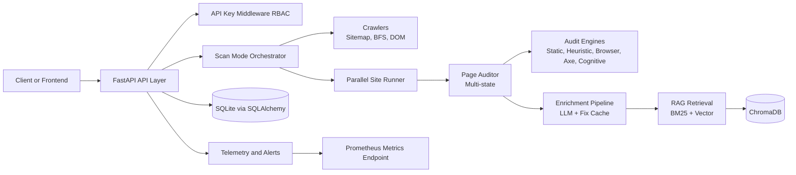

# BEACON Accessibility Intelligence Engine

BEACON is a FastAPI-based accessibility auditing platform with multi-engine scanning, RAG-backed remediation, observability, and API-key RBAC.

## Architecture



## Repository Layout

- `app/`: backend API, audit engines, crawlers, security, observability
- `alembic/`: DB migration scripts
- `corpus/`: source corpus used for ingestion and RAG
- `tests/`: unit, integration, and regression tests
- `.github/workflows/ci.yml`: CI pipeline
- `.env.example`: environment variable template
- `Dockerfile`: production container build

## Setup

### 1. Prerequisites

- Python 3.10+ (3.11 recommended)
- pip
- Optional for deep and max browser scans: Playwright Chromium

### 2. Configure Environment

Create your local environment file from the template:

```bash
cp .env.example .env
```

Update at minimum:

- `FEATHERLESS_API_KEY`
- `BOOTSTRAP_VIEWER_API_KEY`
- `BOOTSTRAP_AUDITOR_API_KEY`
- `BOOTSTRAP_ADMIN_API_KEY`

### 3. Install Dependencies

```bash
pip install -r requirements.txt
```

Optional browser support:

```bash
pip install playwright
playwright install chromium
```

### 4. Run the API

```bash
uvicorn app.main:app --host 0.0.0.0 --port 8000 --reload
```

### 5. Optional: Ingest Corpus

```bash
python run_ingestion.py
```

## Docker

### Build

```bash
docker build -t beacon:latest .
```

Enable Playwright in image:

```bash
docker build --build-arg INSTALL_PLAYWRIGHT=true -t beacon:latest .
```

### Run

```bash
docker run --rm -p 8000:8000 --env-file .env beacon:latest
```

## API Usage

Authentication uses API keys via either header:

- `Authorization: Bearer <key>`
- `X-API-Key: <key>`

### Health

```bash
curl http://localhost:8000/health
```

### Audit URL

```bash
curl -X POST http://localhost:8000/audit \
  -H "Content-Type: application/json" \
  -H "Authorization: Bearer <AUDITOR_KEY>" \
  -d '{
    "url": "https://example.com",
    "scan_mode": "fast"
  }'
```

### Streamed Audit (SSE)

```bash
curl -N -X POST http://localhost:8000/audit/stream \
  -H "Content-Type: application/json" \
  -H "Authorization: Bearer <AUDITOR_KEY>" \
  -d '{
    "url": "https://example.com",
    "scan_mode": "deep"
  }'
```

### Metrics

```bash
curl -H "Authorization: Bearer <ADMIN_KEY>" http://localhost:8000/metrics
```

### History

```bash
curl -G http://localhost:8000/history \
  -H "Authorization: Bearer <VIEWER_KEY>" \
  --data-urlencode "url=https://example.com" \
  --data-urlencode "limit=20"
```

## CI Pipeline

The workflow in `.github/workflows/ci.yml` runs these jobs:

- `lint`: Ruff (blocking) + MyPy (advisory)
- `unit`: unit tests with coverage gate
- `integration`: integration tests
- `security`: pip-audit, Bandit, Gitleaks action
- `benchmark_smoke`: benchmark smoke script + quality gates
- `build` (main branch): Docker image build

To run a local CI parity check:

```bash
ruff check . --select E9,F63,F7,F82
mypy app --strict --ignore-missing-imports
pytest tests/unit -v --cov=app --cov-report=xml --cov-fail-under=40
pytest tests/integration -v
pytest tests/regression -v
bandit -r app -ll
pip-audit -r requirements.txt --desc
python tests/scripts/benchmark_smoke_ci.py
```

Note: the MyPy command is currently informational in CI (non-blocking) while strict typing debt is being worked down.

## Secrets Policy

- Do not commit `.env`.
- Do not commit service-account private keys.
- Keep API keys in environment variables or your secret manager.
- Rotate bootstrap keys before any shared environment deployment.
