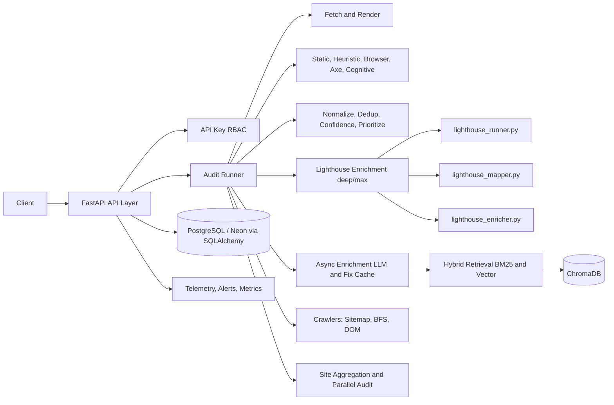

# BEACON Accessibility Intelligence Engine

BEACON is a FastAPI-based accessibility auditing platform with multi-engine scanning, crawler-assisted discovery, RAG-backed remediation, observability, and API-key RBAC.

> **Architecture & Coverage docs**: [docs/architecture/master_architecture.md](docs/architecture/master_architecture.md) | [docs/architecture/ACCESSIBILITY_COVERAGE.md](docs/architecture/ACCESSIBILITY_COVERAGE.md)

## Latest Updates — Phase 21 (April 20, 2026)

- **Lighthouse CI enrichment pipeline** integrated as signal-enrichment layer for `deep`/`max` scan modes.
  - New modules: `app/services/lighthouse_runner.py`, `lighthouse_mapper.py`, `lighthouse_enricher.py`.
  - New config block in `app/config.py`: `LIGHTHOUSE_*` constants (per-URL timeout, concurrency, cache TTL, retry).
  - New mapping file: `app/data/lighthouse_mapping.json` (versioned, v1).
  - New self-audit CI workflow: `.github/workflows/lighthouse_ci.yml`.
- **Lighthouse enrichment pipeline behaviour** (5 deterministic merge rules):
  - BEACON + Lighthouse confirm same rule → `lighthouse_confirmed=True`, severity upgrade if score <50.
  - Lighthouse-only, score <50 → `supplementary` finding added.
  - Lighthouse-only, score 50–89 → `additional_insight` finding added.
  - Lighthouse-only, score ≥90 → dropped silently.
  - **BEACON findings are NEVER deleted, suppressed, or downgraded.**
- **Live 10-site integration test** (`test_comparison.py`) against real-world public sites:
  - 7/10 Lighthouse runs successful; 3 expected failures (DNS, parse error, 91.3s timeout lock).
  - All 3 failures bailed cleanly without crashing the pipeline.
  - Average +30–50% coverage uplift on all functional sites.
  - 0 BEACON findings deleted across all merges.
- **Enrichment mode gate**: Lighthouse only runs in `deep` and `max` modes; `fast` mode is fully unchanged.

## Latest Updates — Phase 20 (April 20, 2026)

- **Site topology detection** wired into the audit pipeline via `app/services/topology_detector.py`.
  - Classifies every crawl as `single_page`, `thin`, `deep_uniform`, `paginated`, or `multi_template`.
  - Topology influences `resolve_max_pages()` cap, ensuring template-diverse crawling.
  - Results persisted in DB (`site_topology`, `templates_found`, `urls_discovered` columns via Alembic migration `81e9864e53a7`).
- **Scan-mode page limit reform** — all crawl caps consolidated in `app/config.py::resolve_max_pages()`. No hardcoded `max_pages` in application code.
- **Degraded-mode hardening** — unreachable and bot-blocked sites reliably surface `degraded_mode=True` with a human-readable `degraded_reason` and full E2 contract fields.
- **Real-site validation** — 30-run all-modes suite (10 sites × fast/deep/max):
  - **30/30 passed** (26 PASS + 4 expected-DEGRADED, 0 FAIL).
  - Results archived in `docs/phase20_rule_distribution.md`.
- **Rule diversity analysis** `docs/phase20_rule_distribution.md` confirms ≥5 unique rule IDs across passing sites with no single rule dominating >70%.

## Latest Updates (April 14, 2026)

- Standardized production scan profiles for site scans (fast/deep/max) with centralized limits in `app/config.py`.
- Added hard safety caps for predictable runtime behavior:
  - `MAX_SCAN_GLOBAL_CAP=80`
  - `MAX_CONCURRENT_SITE_AUDITS=3`
- Dashboard deep/max scan budgets now use centralized caps:
  - deep: 12 pages
  - max: 25 pages
- Dashboard deep/max requests run through the multi-page site orchestrator, with stable normalized metrics:
  - `issue_types_count`
  - `failing_elements_count`
  - `pages_scanned`
  - `pages_discovered`

## Latest Updates (April 2026)

- Restored and hardened multi-mode audit flow: minimal, fast, deep, and max.
- Added crawler stack modules for sitemap, BFS, and DOM discovery under app/crawlers.
- Added multi-state audit orchestration and site-level aggregation under app/audit.
- Added API-key middleware and URL SSRF protections under app/security.
- Added telemetry, alerting, and Prometheus metrics plumbing under app/observability.
- Added reliability hardening for zero-score empty-output failures:
  - output invariants on final payloads
  - stale cache poisoning rejection and recompute
  - non-empty site score safeguards
- Added targeted regression tests for critical bug prevention.

## Latest Updates (April 12, 2026)

- Hardened detector behavior for modern app shells and dynamic sites.
- Added shell-aware landmark suppression to avoid pre-hydration false positives on React and Next.js pages.
- Expanded ARIA role validation to catch mixed valid/invalid role token lists and duplicate role tokens.
- Normalized blocked or partial fetch outcomes into explicit availability findings (access-limited classification).
- Added deterministic site-archetype validation script and baseline output:
  - `evaluation/validate_site_archetypes.py`
  - `evaluation/site_archetype_validation_results.json` (10/10 passing)
- Revalidated ACT regression benchmark with perfect detector metrics:
  - 23 cases evaluated, TP=38, FP=0, FN=0
  - Micro and adjudicated precision/recall/F1 = 1.00
- Re-ran real-world 10-site production benchmark (fast + deep):
  - Runtime success: 20/20 audits
  - Suppression warnings: 0
  - Fast P95: 2.56s (gate <= 3.5s)
  - Deep P95: 27.86s (gate < 60s)
  - Expectation alignment remains advisory on applicable audits; access-limited pages are excluded from strict alignment scoring.

## Architecture



## Scan Modes

| Mode    | Purpose                         | Typical Engines                                                                                   |
| :------ | :------------------------------ | :------------------------------------------------------------------------------------------------ |
| minimal | quickest deterministic baseline | static + heuristic only                                                                           |
| fast    | rapid production checks         | static + heuristic                                                                                |
| deep    | comprehensive page analysis     | static + heuristic + browser + axe (+ Lighthouse enrichment) (+ cognitive on single-page `/audit`) |
| max     | deepest interactive exploration | deep + interaction/scroll + cognitive layers + Lighthouse enrichment                              |

## Production Scan Profiles (Site Scan Path)

These limits are centralized in `app/config.py` and enforced by the scan-mode runner.

| Mode | max_pages | crawl_cap | bfs_depth | bfs_pages | dom_pages | stage1_timeout_s | stage2_timeout_s | global_sla_s | concurrency |
| :--- | --------: | --------: | --------: | --------: | --------: | ---------------: | ---------------: | -----------: | ----------: |
| fast |         1 |        10 |         1 |        10 |         0 |               12 |                4 |           35 |           5 |
| deep |        12 |        30 |         3 |        30 |         0 |               25 |               12 |          120 |           3 |
| max  |        25 |        70 |         4 |        60 |        15 |               40 |               18 |          240 |           2 |

Global caps:

- `MAX_SCAN_GLOBAL_CAP=80`
- `MAX_CONCURRENT_SITE_AUDITS=3`

Dashboard caps:

- `DASHBOARD_DEEP_SCAN_MAX_PAGES=12`
- `DASHBOARD_MAX_SCAN_MAX_PAGES=25`

In max mode, quality gate metadata includes execution proof fields such as:

- playwright_invoked
- interaction_phase_ran
- scroll_phase_ran
- exploration_layer_ran

## Reliability and Safety Guarantees

Recent hardening prevents the zero-score and empty-output failure class:

- base audit result is protected from enrichment failure side effects
- pages audited cannot return non-positive score without safe repair
- issues payload is always list-normalized
- stale cached payloads with invalid invariants are discarded and recomputed
- site aggregator enforces non-empty page score guardrails

## Repository Layout

- `app/`
  - `app/services/` — core engines, scoring, enrichment, caching, topology detection
    - `lighthouse_runner.py` — headless Chrome subprocess runner (Phase 21)
    - `lighthouse_mapper.py` — raw Lighthouse JSON → BEACON findings_schema (Phase 21)
    - `lighthouse_enricher.py` — 5-rule deterministic merge engine (Phase 21)
  - `app/data/`
    - `lighthouse_mapping.json` — versioned Lighthouse audit inclusion list (v1, Phase 21)
  - `app/audit/` — page auditor, parallel runner, site aggregation, scan-mode runner
  - `app/crawlers/` — sitemap, BFS, DOM crawlers and orchestrator
  - `app/security/` — API-key RBAC and URL validation
  - `app/observability/` — telemetry, alerts, logging, metrics
  - `app/db/` — SQLAlchemy models, Alembic migrations, repository
- `alembic/versions/` — DB migrations (tracked in git)
  - `c9e1f3a27b84` — adds `lighthouse_enrichment` JSON column to `scans` table (Phase 21)
  - `81e9864e53a7` — adds topology columns to `scans` table (Phase 20)
- `tests/unit/` — unit tests including Phase 20 topology + scan-mode tests
  - `tests/unit/services/test_lighthouse_runner.py` (Phase 21)
  - `tests/unit/services/test_lighthouse_mapper.py` (Phase 21)
  - `tests/unit/services/test_lighthouse_enricher.py` (Phase 21)
- `tests/integration/` — real-site integration suites (Phase 19 & 20)
- `test_comparison.py` — live 10-site BEACON vs BEACON+Lighthouse benchmark (Phase 21)
- `.github/workflows/lighthouse_ci.yml` — self-audit CI for the BEACON dashboard (Phase 21)
- `.lighthouserc.json` — Lighthouse CI assertion thresholds (Phase 21)
- `scripts/` — CLI audit runner and validation helpers
- `docs/` — analysis reports, CLI reference, triage notes
- `corpus/` — source corpus used for ingestion and RAG
- `.env.example` — environment variable template (never commit `.env`)

## Setup

### 1. Prerequisites

- Python 3.10+
- pip
- Optional for deep and max browser scans: Playwright Chromium
- Optional for Lighthouse enrichment (deep/max): Node.js 18+ and Lighthouse CLI

  ```bash
  npm install -g lighthouse
  ```

- **Required for deep/max Camoufox-backed browser sessions**: after installing Python dependencies, download the Camoufox browser binary:

  ```bash
  python -m camoufox fetch
  ```

  > **Why?** Camoufox ships without a bundled browser binary to keep the PyPI package small. The first `deep` or `max` scan will fail with `camoufox: browser binary not found` unless you run this one-time fetch command. Re-run after upgrading `camoufox` to a new major release.

  Optionally also fetch the GeoIP database (improves geo-fingerprint realism, needed for some bot-wall bypass tests):

  ```bash
  python -m camoufox fetch --geoip
  ```

### 2. Configure Environment

Create local environment file:

```bash
cp .env.example .env
```

On PowerShell:

```powershell
Copy-Item .env.example .env
```

Set at minimum:

- FEATHERLESS_API_KEY
- BOOTSTRAP_VIEWER_API_KEY
- BOOTSTRAP_AUDITOR_API_KEY
- BOOTSTRAP_ADMIN_API_KEY

Optional production scan tuning keys:

- DASHBOARD_DEEP_SCAN_MAX_PAGES
- DASHBOARD_MAX_SCAN_MAX_PAGES
- MAX_SCAN_GLOBAL_CAP
- MAX_CONCURRENT_SITE_AUDITS

Optional Lighthouse enrichment tuning keys (all have sane defaults in `app/config.py`):

- LIGHTHOUSE_MAX_URLS_PER_SCAN (default: 5)
- LIGHTHOUSE_PER_URL_TIMEOUT_SECONDS (default: 90)
- LIGHTHOUSE_GLOBAL_TIMEOUT_SECONDS (default: 300)
- LIGHTHOUSE_MAX_CONCURRENT_RUNS (default: 2)
- LIGHTHOUSE_CACHE_TTL_SECONDS (default: 3600)
- LIGHTHOUSE_RETRY_COUNT (default: 1)

### 3. Install Dependencies

```bash
pip install -r requirements.txt
```

Optional browser support (Playwright fallback path only):

```bash
pip install playwright
playwright install chromium
```

> **Camoufox** is the primary browser runtime for deep/max scans. It is installed automatically via `requirements.txt` (`camoufox[geoip]`). You still need to run `python -m camoufox fetch` (see Prerequisites above) to download the binary.

### 4. Run the API

```bash
uvicorn app.main:app --host 0.0.0.0 --port 8000 --reload
```

### 5. Optional: Ingest Corpus

```bash
python run_ingestion.py
```

## API Usage

Authentication headers:

- Authorization: Bearer <key>
- X-API-Key: <key>

Role model:

- viewer: read-only endpoints
- auditor: can run audits
- admin: can access metrics and admin utilities

### Health

```bash
curl http://localhost:8000/health
```

### Run Audit

```bash
curl -X POST http://localhost:8000/audit \
  -H "Content-Type: application/json" \
  -H "Authorization: Bearer <AUDITOR_KEY>" \
  -d '{
    "url": "https://example.com",
    "scan_mode": "max"
  }'
```

### Streamed Audit (SSE)

```bash
curl -N -X POST http://localhost:8000/audit/stream \
  -H "Content-Type: application/json" \
  -H "Authorization: Bearer <AUDITOR_KEY>" \
  -d '{
    "url": "https://example.com",
    "scan_mode": "deep"
  }'
```

### Poll Async Enrichment

```bash
curl -H "Authorization: Bearer <VIEWER_KEY>" \
  http://localhost:8000/audit/enrichment/<AUDIT_ID>
```

## Observability Endpoints

- GET /metrics (admin)
- GET /audit/cache/stats (admin)
- GET /history?url=<url>&limit=<n>

Examples:

```bash
curl -H "Authorization: Bearer <ADMIN_KEY>" http://localhost:8000/metrics
```

```bash
curl -H "Authorization: Bearer <ADMIN_KEY>" http://localhost:8000/audit/cache/stats
```

## Detailed CLI Audit (Any URL / Mode)

Run a complete single-command audit bundle (raw JSON + markdown + CSV + dedup/group/WCAG summaries):

```bash
python scripts/run_detailed_audit_cli.py https://example.com --scan-mode fast
```

Deep and max examples:

```bash
python scripts/run_detailed_audit_cli.py https://www.nytimes.com --scan-mode deep --show-top 30
python scripts/run_detailed_audit_cli.py https://www.wikipedia.org --scan-mode max --enable-enrichment --await-enrichment
```

See full flag reference in `docs/detailed_cli_audit.md`.

## Focused Regression Validation

Use this command to validate the critical reliability fixes:

```bash
python -m pytest \
  tests/unit/services/test_audit_runner_critical_bug.py \
  tests/unit/services/test_browser_prober_max_exploration.py \
  tests/unit/audit/test_site_aggregator.py -q
```

Additional detector validation commands:

```bash
python evaluation/validate_site_archetypes.py
python evaluation/benchmark_act.py
python evaluation/benchmark_production.py
```

## Pre-Push Checklist

Run before opening a PR or pushing to shared branches:

```bash
# Syntax check core modules (including Phase 21 Lighthouse modules)
python -m py_compile \
  app/config.py \
  app/audit/scan_mode_runner.py \
  app/routers/dashboard_api.py \
  app/services/topology_detector.py \
  app/services/lighthouse_runner.py \
  app/services/lighthouse_mapper.py \
  app/services/lighthouse_enricher.py

# Unit tests — includes Phase 21 Lighthouse unit tests (~6–10s)
python -m pytest tests/unit/ -q

# Lighthouse unit test suite (subset, for fast feedback)
python -m pytest \
  tests/unit/services/test_lighthouse_runner.py \
  tests/unit/services/test_lighthouse_mapper.py \
  tests/unit/services/test_lighthouse_enricher.py \
  -q --timeout=30

# Integration smoke — fast-mode only (~40s)
python -m pytest tests/integration/test_phase20_all_modes.py -k "fast" -q --timeout=90

# Lighthouse live integration test — requires Node.js + lighthouse CLI installed
# (runs against 10 real-world sites; ~10–15 minutes on a residential connection)
python test_comparison.py

# DB migration state — must be at head (c9e1f3a27b84)
alembic current

# Repo hygiene — confirm .env is NOT staged
git status --short
```

Push hygiene:

- `.env` stays local — **never stage it**. Confirm with `git status` before every push.
- Keep `.env.example` updated when new env keys are introduced.
- Phase run outputs (`phase*.json`, `*.log`) are gitignored; keep them local only.
- Ensure scan mode docs (`README.md` table) match values in `app/config.py::SCAN_MODES`.

## Important Notes

- Cognitive scoring is experimental and intentionally isolated from core hard-rule detection.
- Enrichment is asynchronous by design and may return pending initially.
- Never commit secrets (.env files, serviceAccountKey.json, private API keys).
- The `camoufox` browser binary must be fetched once with `python -m camoufox fetch` before running deep/max scans.
- Lighthouse enrichment requires Node.js 18+ and `npm install -g lighthouse`. Without it, deep/max scans continue with BEACON-only results.
- BEACON currently implements 55.2% (32/58) WCAG 2.2 A/AA criterion coverage. See [ACCESSIBILITY_COVERAGE.md](docs/architecture/ACCESSIBILITY_COVERAGE.md) for the full breakdown.

## Architecture & Related Docs

- [docs/architecture/master_architecture.md](docs/architecture/master_architecture.md) — full system architecture (v2.5)
- [docs/architecture/ACCESSIBILITY_COVERAGE.md](docs/architecture/ACCESSIBILITY_COVERAGE.md) — WCAG 2.2 coverage classification
- [docs/plans/completed/](docs/plans/completed/) — completed implementation plans per phase
