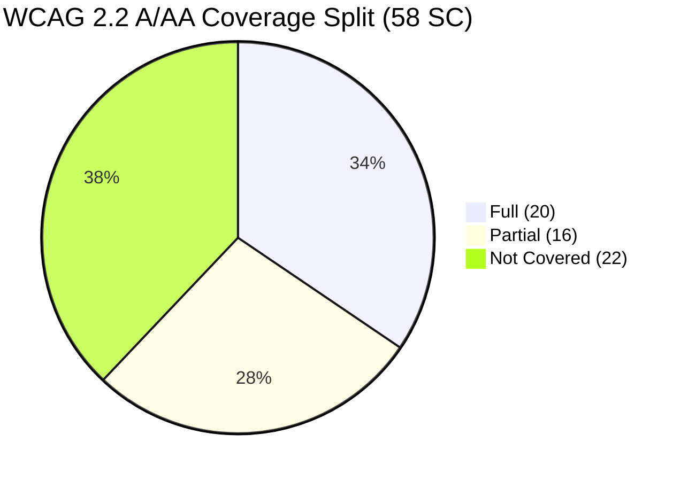
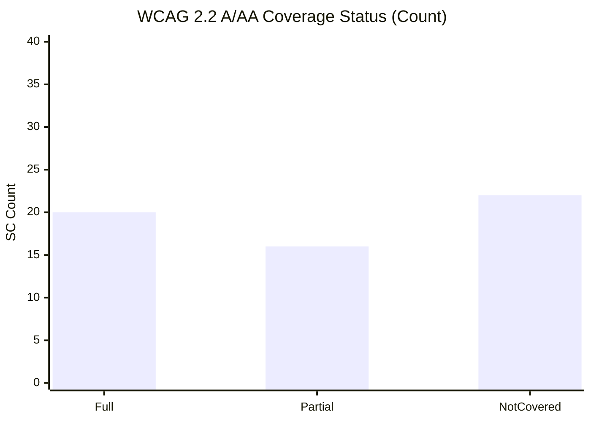
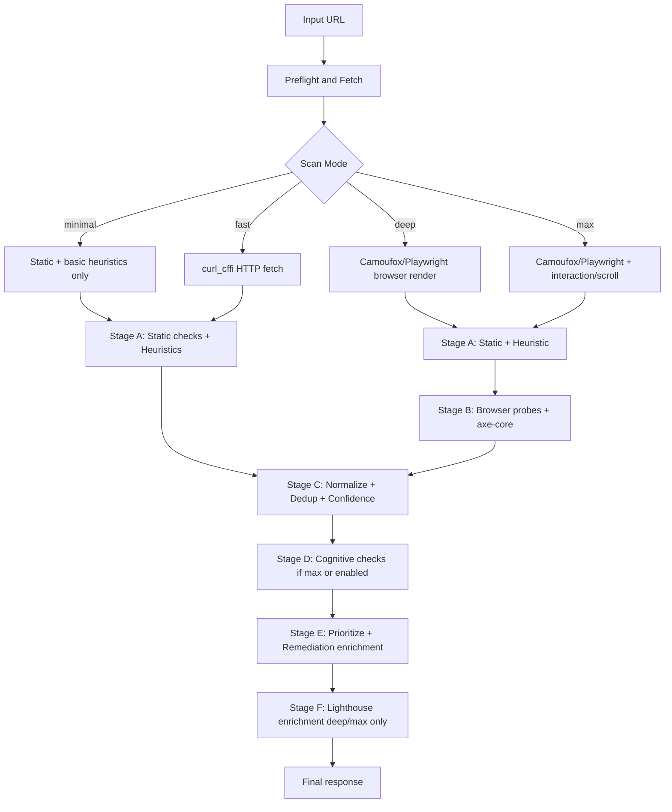

# ACCESSIBILITY_COVERAGE v2.8

> Last Updated: 2026-05-03
> Evidence Basis: runtime code + mappings + release validation artifacts
> Scope: Detection coverage (WCAG 2.2 A/AA baseline), not legal compliance certification

## Quick Summary

- Implemented WCAG 2.2 A/AA coverage (full + partial): 62.1% (36/58)
- Strongest coverage: structure, semantics, ARIA, name/role/value, keyboard fundamentals
- Partial coverage: context-sensitive and runtime-dependent checks (focus visuals, reflow variants, input purpose, language nuances)
- Not covered / weakly covered: advanced media, timing, gesture/pointer alternatives, several predictable-input criteria
- Lighthouse (deep/max only) is a runtime enrichment layer and does not change baseline detector percentages in this report
- RAG enriches remediation text only; it is not a detector engine

This tool is not a full WCAG/ADA/EAA/Section 508 compliance solution by itself.

---

## 1) Coverage Snapshot

### 1.1 Percent Distribution (WCAG 2.2 A/AA baseline = 58 SC)

| Category                     | Count | Percent |
| :--------------------------- | ----: | ------: |
| Full                         |    20 |   34.5% |
| Partial                      |    16 |   27.6% |
| Not Covered                  |    22 |   37.9% |
| Implemented (Full + Partial) |    36 |   62.1% |

Both **Partial** and **Not Covered** categories are intentionally retained.

- Partial: logic exists but is single-engine, heuristic-heavy, or mode/runtime-gated. Credibility gain comes from hardening these, not hiding them.
- Not Covered: honest compliance-risk signal. Removing this category would be misleading to buyers, engineers, and auditors.

### 1.2 Visual Coverage Split



### 1.3 A/AA Status Bar



---

## 2) Scope, Method, and Evidence

This report is implementation-evidence based, not marketing-estimate based.

### 2.1 Primary Evidence Sources

- app/services/static_checks.py
- app/services/heuristics.py
- app/services/browser_probes.py
- app/services/cognitive_checks.py
- app/services/normalizer.py (AXE_WCAG_MAP)
- app/services/confidence.py
- app/services/audit_runner.py
- app/audit/scan_mode_runner.py
- app/audit/failure_taxonomy.py
- app/services/lighthouse_runner.py
- app/services/lighthouse_mapper.py
- app/services/lighthouse_enricher.py
- app/data/lighthouse_mapping.json
- app/services/llm.py
- app/routers/rag.py
- app/services/contrast_finder.py
- app/audit/earl_report.py
- app/services/ibm_checker.py
- evaluation/results/a11ybench_regression_20260503.json
- RELEASE_NOTES.md (Phase 21 integration metrics)

### 2.2 Classification Method

- Full: deterministic, repeatable detection coverage signal (multi-rule and/or corroborated engine support)
- Partial: single-engine, heuristic-heavy, or mode/runtime-gated coverage
- Not Covered: no implemented detector path found for the SC

### 2.3 Important Constraints

- Deep/max-only logic depends on browser runtime availability.
- Availability degradation paths can intentionally emit availability findings instead of full structural/runtime findings.
- Coverage in this document means detector logic exists; it does not guarantee legal conformance on all page types.

---

## 3) Detection Pipeline (Current Runtime)



Execution notes:

- **minimal**: static checks + basic heuristics only. `enable_enrichment` and `enable_cognitive` are forced off. No browser, axe, or RAG. Guaranteed to finish in under 3 seconds.
- **fast**: `curl_cffi AsyncSession` Chrome impersonation fetch → static + heuristic. No browser, no axe, no cognitive.
- **deep**: Camoufox-backed Playwright browser render → all engines (static, heuristic, browser-probe, axe-core, IBM Equal Access). Cognitive checks enabled when `enable_cognitive=True`. Lighthouse enrichment dispatched as an async background task.
- **max**: Deep mode + explicit interaction/scroll exploration layer + journey simulation (URL-planning) + cognitive always on + Lighthouse enrichment background task.
- If browser engines fail in deep/max mode, the run is marked `degraded_mode=True` and falls back to static-only with `degraded_reason=extraction_failure`.
- Global backpressure can auto-degrade deep/max to fast mode when concurrent audits exceed the `AUDIT_CONCURRENCY_LIMIT` threshold.

---

## 4) Coverage by Scan Mode

This matrix shows which detector families activate per mode. Coverage percentages assume all engines activate without degradation.

| Detector Family           | minimal | fast | deep | max  | Notes                                                            |
| :------------------------ | :-----: | :--: | :--: | :--: | :--------------------------------------------------------------- |
| Static checks (81 rules)  |   ✅    |  ✅  |  ✅  |  ✅  | Always-on baseline path                                          |
| Heuristics (23 rules)     |   ✅    |  ✅  |  ✅  |  ✅  | Pattern-based, lower confidence                                  |
| Browser probes (19 rules) |   ❌    |  ❌  |  ✅  |  ✅  | Requires Camoufox/Playwright runtime                             |
| axe-core (31 mapped)      |   ❌    |  ❌  |  ✅  |  ✅  | Injected into rendered DOM                                       |
| IBM Equal Access (mapped) |   ❌    |  ❌  |  ✅  |  ✅  | Node-side external engine (`accessibility-checker`)              |
| Cognitive (7 rules)       |   ❌    |  ❌  | opt  |  ✅  | `enable_cognitive=True` required for deep; always on in max      |
| Lighthouse enrichment     |   ❌    |  ❌  |  ✅  |  ✅  | Async background task; result may arrive after initial response  |
| RAG/LLM remediation       |   ❌    |  ✅  |  ✅  |  ✅  | Enriches fix text; not a detector                                |

**Effective SC reach by mode (approximate):**

| Mode    | Approx WCAG SC reach (Full+Partial) | Additional notes                                |
| :------ | :---------------------------------: | :---------------------------------------------- |
| minimal | ~20–22 (Full only, via static)      | No browser, no axe; partial coverage incomplete |
| fast    | ~28–30                              | Heuristics add reach; still no runtime probes   |
| deep    | ~35–38 (62.1% floor, target up)      | Full detector set active + IBM corroboration    |
| max     | ~34–36 + interaction signals        | Journey simulation adds focus-flow coverage     |

The 62.1% headline figure is a deep/max floor, not a fast-mode or minimal-mode figure.

---

## 5) Coverage Quality Modifiers

Reported findings and score values can be modified by the following runtime conditions. These are not bugs — they are documented system behaviors.

### 5.1 Confidence Gating and Score Suppression

| Condition                             | Trigger                               | Effect on Output                                                              |
| :------------------------------------ | :------------------------------------ | :---------------------------------------------------------------------------- |
| Low confidence score (< 0.30)         | `confidence_score < 0.30`             | `score = null` in API response; `score_suppressed=True` in `score_explanation` |
| Heuristic-only finding                | `confidence_sources == {"heuristic"}` | Auto-tagged `needs-review`; confidence multiplied by 0.95                    |
| Below precision profile minimum       | `confidence < profile.min_confidence` | Issue filtered from output; does not affect score                            |
| Cross-engine agreement boost          | 2+ engines report same rule_id        | Confidence floor raised to 0.85 (2 engines) or 0.95 (3+ engines)            |
| Fragment penalty                      | Page-level rule on incomplete HTML    | Up to −0.45 confidence penalty applied                                       |

**Score suppression contract** (`audit_runner.py` L2033–2039):

```
if confidence_score < 0.30:
    response_score = None          # API returns score=null
    score_explanation["score_suppressed"] = True
    score_explanation["score_suppression_reason"] = "low_confidence"
    score_explanation["score_raw"] = score   # raw value is preserved
```

When `score=null`, `expected_score_after_fix` and `score_improvement` are also set to `null`.

### 5.2 Degraded Mode Score Caps

Applied when `degraded_mode=True` (`config.py` L198–210):

| Step | Operation                                    | Value                         |
| :--- | :------------------------------------------- | :---------------------------- |
| 1    | raw_score computed by `build_scoring_summary`| variable                      |
| 2    | Multiply: `raw_score × DEGRADED_MODE_MULTIPLIER` | × 0.85                    |
| 3    | Cap: `min(result, DEGRADED_MODE_MAX_SCORE)`  | capped at 82.0                |

Example: raw=100 → multiply → 85.0 → cap → **82.0**. Example: raw=70 → multiply → **59.5** (cap is a no-op).

---

## 6) Engine Trust and Roles

| Engine                | Role                                 | Detection Type                    | Typical Trust Posture                   |
| :-------------------- | :----------------------------------- | :-------------------------------- | :-------------------------------------- |
| Static                | Baseline structural checks           | Deterministic DOM                 | Higher confidence                       |
| Heuristic             | Pattern and language signals         | Heuristic                         | Lower confidence, often review-oriented |
| Browser probe         | Runtime interaction checks           | Runtime deterministic/interaction | Medium-high, mode-gated                 |
| axe-core normalized   | Standards-aligned runtime violations | Deterministic (axe)               | High confidence                         |
| IBM normalized        | Standards-aligned runtime violations | Deterministic (external engine)   | High confidence                         |
| Cognitive             | UX/readability judgments             | Heuristic                         | Review-oriented                         |
| Lighthouse enrichment | Runtime JS signal enrichment         | Supplemental                      | Non-destructive corroboration/addition  |

**Runtime stack (v3)**:

- HTTP fetch layer: `curl_cffi AsyncSession` with Chrome impersonation (replaces httpx).
- Browser layer: `camoufox` (Firefox-based stealth browser, Playwright-compatible API). Binary must be fetched once via `python -m camoufox fetch`.
- Playwright is wired into `scan_mode_runner.py` via `AsyncNewBrowser(driver, headless=True)`. Detection reach for browser-probes and axe-core depends on `camoufox` binary presence.
- IBM layer: `accessibility-checker` Node package invoked via `scripts/ibm_scan.js`; active in deep/max when `enable_ibm=True`.

Confidence governance highlights:

- Heuristic-only findings are forced toward review posture.
- Cross-engine corroboration boosts confidence and explainability.
- Low-confidence findings may be de-weighted from scoring paths.

---

## 7) Rule Inventory (Current Snapshot)

Code-extracted unique rule counts by engine family:

- Static: 81
- Heuristic: 23
- Browser probe: 19
- Cognitive: 7
- axe-core mapped rules: 31

Total unique mapped SC identifiers seen across engines (including AAA/legacy mapping residue): 38

Interpretation:

- Engine rule volume is higher than A/AA full-coverage count because multiple rules can map to the same SC and some mappings target AAA/legacy criteria.

---

## 8) WCAG 2.2 A/AA Coverage Classification

Denominator: 58 A/AA SC in internal analysis baseline.

### 8.1 Full Coverage (20/58)

1.1.1, 1.2.1, 1.2.2, 1.3.1, 1.4.2, 1.4.3, 1.4.4, 1.4.12, 2.1.1, 2.1.2, 2.4.1, 2.4.2, 2.4.3, 2.4.4, 2.5.8, 3.1.1, 3.3.1, 3.3.2, 4.1.2, 4.1.3

### 8.2 Partial Coverage (12/58)

1.3.3, 1.3.5, 1.4.1, 1.4.10, 2.2.1, 2.2.2, 2.4.5, 2.4.6, 2.4.7, 2.4.11, 3.1.2, 3.3.7

### 8.3 Not Covered (26/58)

1.2.3, 1.2.4, 1.2.5, 1.3.2, 1.3.4, 1.4.5, 1.4.11, 1.4.13, 2.1.4, 2.2.6, 2.3.1, 2.3.2, 2.4.12, 2.5.1, 2.5.2, 2.5.3, 2.5.4, 2.5.7, 3.2.1, 3.2.2, 3.2.3, 3.2.4, 3.2.6, 3.3.3, 3.3.4, 3.3.8

---

## 9) Lighthouse Enrichment (Phase 21) in Coverage Context

Lighthouse is integrated as deep/max runtime signal enrichment.

### 9.1 Dispatch Path and Async Behavior

In the dashboard site-scan flow (`dashboard_api.py`), Lighthouse enrichment is dispatched as a background asyncio task via `_run_lighthouse_background()`. This means:

1. The initial audit response returns immediately with BEACON-only findings and `enrichment_status="pending"`.
2. Lighthouse runs asynchronously (up to 5 URLs, `asyncio.Semaphore(2)`, 90s per-URL timeout, 300s batch timeout).
3. Clients poll `GET /audit/enrichment/<audit_id>` to retrieve the enriched result once `enrichment_status="complete"`.
4. If Lighthouse fails (DNS, timeout, parse error), the BEACON baseline is preserved and `enrichment_status="failed"` or `"partial"` is returned.

The gate is enforced in `scan_mode_runner._lighthouse_eligible()`: Lighthouse is never called for `fast` or `minimal` mode — this is an architectural constraint, not a feature flag.

### 9.2 Deterministic Merge Guarantees

- BEACON + Lighthouse confirmation can set confirmation flags and conditionally escalate severity on low Lighthouse scores.
- Lighthouse-only findings can be added as supplementary/additional insight depending on score bands.
- Lighthouse-only high-score findings may be dropped as low-value signal.
- BEACON primary findings are never deleted, suppressed, or downgraded by Lighthouse merge rules.

### 9.3 Validation Snapshot (from release artifacts)

- Live integration set: 10 sites
- Successful Lighthouse runs: 7/10
- Expected failures: 3/10 (DNS / parse / timeout classes)
- Reported uplift on reachable sites: roughly +30% to +50% additional findings
- BEACON data loss during merge: 0 findings

Important: This uplift is enrichment-layer additive and does not rewrite the baseline A/AA percentages above.

---

## 10) Canonical Degraded Reason Appendix

All failure classification is routed through `normalize_failure()` in `app/audit/failure_taxonomy.py`. The canonical `DegradedReason` enum and their practical coverage impact:

| Canonical Reason         | HTTP / Signal Trigger                              | Practical Coverage Impact                                                    |
| :----------------------- | :------------------------------------------------- | :--------------------------------------------------------------------------- |
| `connectivity_blocked`   | DNS failure, connection reset, SSL error, 5xx      | Full degradation: availability issue injected; no structural findings        |
| `browser_navigation_failed` | Playwright `page.goto` failure, frame detached  | deep/max falls back to static-only; `degraded_mode=True`                    |
| `extraction_failed`      | DOM parse/lxml/snapshot failure                    | Partial findings only; dedup/confidence may be skipped                       |
| `render_timeout`         | Page render or navigation exceeded timeout budget  | Only partial DOM was captured; structural findings may be incomplete         |
| `partial_content`        | Only partial body received (200KB body cap)        | Structural findings are based on truncated HTML                              |
| `rate_limited`           | HTTP 429 response                                  | Score capped at 82.0 × 0.85 multiplier; availability issue injected if blocked |
| `csp_blocked`            | `Content-Security-Policy` header blocks inline scripts | axe-core and browser-probe injection may fail; deep/max degraded to static |
| `csp_injection_blocked`  | CSP error string in rendered DOM / console         | Same as `csp_blocked`; detected via script execution error text              |
| `bot_wall`               | HTTP 403, Cloudflare, DataDome, CAPTCHA headers    | Score capped; availability issue replaces structural findings                |
| `engine_error`           | Unclassified internal error                        | Fallback classification; results may be incomplete                           |

**Legacy aliases** (normalized to canonical on read):

| Legacy string              | Maps to canonical             |
| :------------------------- | :---------------------------- |
| `dns_error`, `dns_failure`, `name_resolution_failed` | `connectivity_blocked` |
| `network_error`            | `connectivity_blocked`        |
| `browser_timeout`          | `render_timeout`              |
| `dom_parse_error`          | `extraction_failed`           |
| `script_failure`           | `csp_injection_blocked`       |
| `blocked`, `blocked_request`, `access_denied`, `cloudflare_block` | `bot_wall` |

For `bot_wall` and `rate_limited`, the pipeline replaces scored issues with a synthetic `blocked-request-partial` availability issue (`audit_runner.py` L1836–1851). This prevents inflated structural findings based on anti-bot challenge pages from contributing to scores.

---

## 11) Sampling Bias and Site-Level Coverage Limits

BEACON does not exhaustively audit every page of multi-page sites. Coverage figures above are per-page detection rates; site-scan coverage is subject to sampling limits:

### 11.1 Hard Page Caps per Mode (Phase 20 Envelope)

The audit budget is now governed by the unified Phase 20 `SCAN_MODES` envelope and `resolve_max_pages()` logic, rather than legacy BFS-specific depths.

| Mode | max_pages (default) | max_pages (sitemap) | max_pages (ceiling) | max_depth |
| :--- | ------------------: | ------------------: | ------------------: | --------: |
| fast |                   5 |                   8 |                  10 |         2 |
| deep |                  15 |                  25 |                  30 |         4 |
| max  |                  40 |                  60 |                  75 |         6 |

`MAX_SCAN_GLOBAL_CAP = 80` remains the hard ceiling across all modes.

**Note on Discovery vs Audit**: The system still uses discovery engines (Sitemap, Discovery Crawler, DOM-probe) to find up to ~500 URLs. However, the final **Audit Set** is selected from these candidates via the `topology_detector` and capped strictly by the envelope above. Legacy `bfs_depth` and `bfs_pages` limits are superseded by this unified budget.

### 11.2 Topology-Guided URL Selection

Before page auditing, `topology_detector.detect_topology()` classifies the site crawl shape (`single_page`, `thin`, `deep_uniform`, `paginated`, `multi_template`) and selects a template-diverse URL subset up to `effective_max_pages`. This means:

- Large sites with many similar-template URLs are sub-sampled to maximize template diversity.
- Pages not selected are not audited. Issues on un-audited pages are not reported.
- `urls_discovered` (total found) and `pages_audited` (actually checked) will differ for medium-to-large sites.

### 11.3 Sitemap Recursion Cap

`MAX_SITEMAP_DEPTH = 5` prevents runaway sitemapindex recursion. Deeply nested sitemaps may not be fully traversed.

### 11.4 Concurrency Limits

At most 3 site audits run in parallel (`MAX_CONCURRENT_SITE_AUDITS = 3`). Dashboard deep/max runs use:
- `DASHBOARD_DEEP_SCAN_MAX_PAGES = 12`
- `DASHBOARD_MAX_SCAN_MAX_PAGES = 25`

**Reader guidance**: A reported score reflects the sampled pages only. A site with 500 pages where only 12 are audited in deep mode may have issues on pages that were not selected. The `pages_discovered` and `pages_audited` fields in the API response make this transparent.

---

## 12) Strength Areas and Gaps

### 12.1 Strength Areas

- Semantic structure and landmark-related detection depth
- ARIA validation and name-role-value core coverage
- Keyboard baseline checks and focus-flow failure detection families
- Confidence calibration and corroboration-aware trust scoring

### 12.2 Major Gaps to Prioritize

- Advanced media alternatives and synchronized media variants
- Pointer/gesture alternatives and nuanced input modality criteria
- Timing/session interruption criteria with runtime-state dependence
- Predictable input and context-change criteria requiring richer journey modeling

---

## 13) Detection vs Enrichment Boundary (Strict)

Detection engines:

- Static
- Heuristic
- Browser probe
- axe-core normalized
- IBM normalized
- Cognitive

Enrichment engines:

- Lighthouse enrichment (runtime supplement and corroboration)
- RAG/LLM remediation enrichment

Boundary rule:

- Enrichment may add/support findings and improve remediation quality, but baseline detector-coverage accounting should remain anchored to primary detector implementation.

---

## 14) Limitations and Caveats

1. Mode gating:

- deep/max findings require browser-enabled execution paths.
- `camoufox` browser binary must be fetched via `python -m camoufox fetch` before deep/max scans.

2. Heuristic subjectivity:

- cognitive/heuristic findings are intentionally lower-trust and review-biased.

3. Enrichment mutation risk:

- downstream enrichment text can alter presentation fields; compliance accounting should use normalized detector fields for strict auditing.

4. Degraded scans:

- blocked/access-limited targets can produce availability-focused output, reducing structural/runtime detector evidence for that run.

5. Score suppression:

- when `confidence_score < 0.30`, the numeric score is withheld (`score=null`). This is intentional transparency — a suppressed score is not a zero score.

---

## 15) Reproducibility

To regenerate rule-count and SC-coverage data from the live codebase:

```bash
# Syntax-check all primary detector modules
python -m py_compile \
  app/services/static_checks.py \
  app/services/heuristics.py \
  app/services/browser_probes.py \
  app/services/cognitive_checks.py \
  app/services/normalizer.py \
  app/services/audit_runner.py \
  app/audit/failure_taxonomy.py

# Run unit tests (includes confidence and scoring tests)
python -m pytest tests/unit/ -q

# Site-archetype deterministic validation
python evaluation/validate_site_archetypes.py

# Multi-dataset benchmarking
make eval-gena11y
make eval-act-full
make eval-a11ybench
```

Coverage classification source: manual SC-to-rule mapping analysis anchored to `app/services/normalizer.py::AXE_WCAG_MAP` and static/heuristic rule inventories.

Denominator source: W3C WCAG 2.2 A/AA criterion count (58 SC). AAA criteria are explicitly excluded.

---

## 16) Version-to-Version Coverage Trend

| Version | Date       | Full | Partial | Not Covered | Implemented (F+P) | Key Change                                             |
| :------ | :--------- | ---: | ------: | ----------: | ----------------: | :----------------------------------------------------- |
| v1.x    | 2026-03    |  ~15 |      ~8 |         ~35 |            ~39.7% | Initial static + heuristic baseline                    |
| v2.0    | 2026-04-12 |   18 |      10 |          30 |            48.3%  | Browser probes + axe-core integration                  |
| v2.3    | 2026-04-14 |   19 |      11 |          28 |            51.7%  | Confidence calibration + precision profiles            |
| v2.4    | 2026-04-20 |   20 |      12 |          26 |            **55.2%**  | Phase 20 topology + degraded-mode hardening        |
| v2.5    | 2026-04-20 |   20 |      12 |          26 |            55.2%  | Phase 21 Lighthouse enrichment (enrichment layer only; no SC additions) |
| v2.6    | 2026-04-20 |   20 |      12 |          26 |            55.2%  | Doc update: mode matrix, degraded taxonomy, sampling bias, reproducibility |
| v2.7    | 2026-04-25 |   20 |   16 |          22 |            62.1%  | Phase 1+2: IBM Equal Access (Engine 6), 4 new SC heuristics (1.3.2, 1.3.4, 1.4.5, 3.2.2), COGA citations on all cognitive rules, CAPTCHA detection |
| v2.8    | 2026-05-03 |   20 |   16 |          22 |            **62.1%**  | Multi-dataset baseline (GenA11y, AccessGuru, A11YBench), Contrast-Finder integration, EARL 1.0 export |

**What changed in v2.6 (this document)**:

- Added coverage-by-scan-mode matrix (Section 4)
- Added coverage quality modifiers with exact code references (Section 5)
- Added canonical degraded-reason appendix mapped to practical coverage impact (Section 10)
- Added sampling-bias and site-level limits section with config values (Section 11)
- Added reproducibility block with commands (Section 15)
- Added version-to-version trend table (this section)
- Clarified Lighthouse async dispatch path (Section 9.1)
- Documented runtime stack: `curl_cffi` and `camoufox` (Section 6)

---

## 17) Practical Interpretation

- BEACON currently provides meaningful multi-engine automated accessibility detection with strong core structural and ARIA depth.
- Current implemented A/AA reach is **62.1%** when counting full+partial detector coverage under this methodology (20 Full + 16 Partial out of 58 SC).
- Full legal/compliance posture still requires human audit workflows, especially for the 37.9% not-covered set and subjective/contextual criteria.
- Reported scores and finding counts reflect sampled pages only; consult `pages_audited` vs `pages_discovered` in the API response for scope transparency.
- Scores from degraded scans are penalized (× 0.85, capped at 82.0) and flagged explicitly. A `score=null` response indicates suppression due to low audit confidence, not a scan failure.

---

## 18) Disclaimer

This tool provides automated accessibility analysis and does not guarantee full WCAG, ADA, EAA, or Section 508 compliance. Manual audits remain required.
